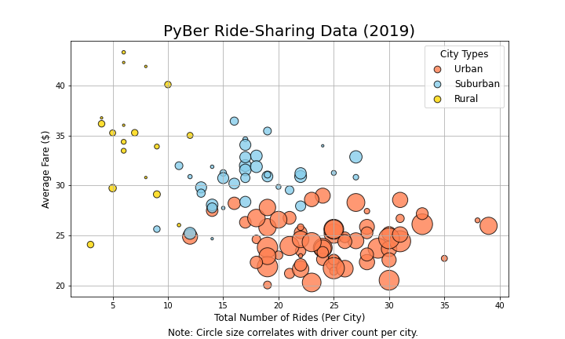
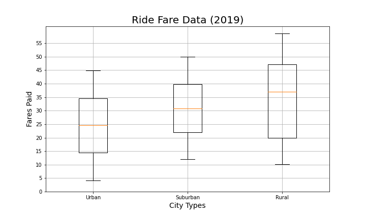
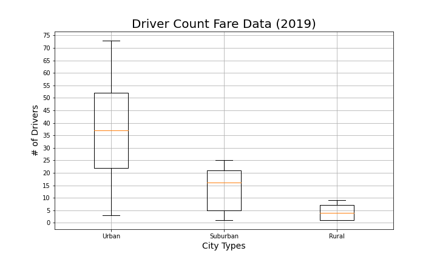
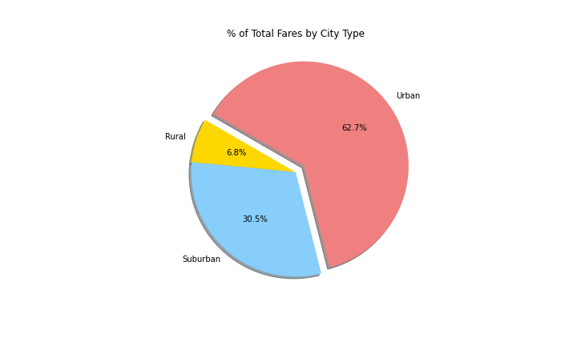
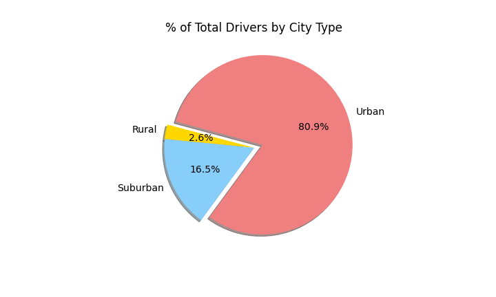
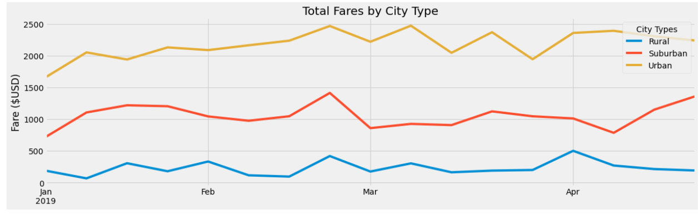

# PyBer_Analysis
Performing analysis on Ride Share data of PyBer, a ride service company.
## Overview of PyBer Analysis
he project PyBer Analysis is comprise of analysis and visualization of ride share data of PyBer ride share company which is valued at $2.3 billion. Here as a data analyst, i am assigned to work on a project with a team to create analysis of data from January to May 2019 and also to visualize the data in graphs and charts to share relationship between cities where services served, driver's count, total fare along with determining access to ride sharing services and determine affordability. 
## Results of PyBer Analysis
### Images for summary of data frame of PyBer Analysis 

### Observations
- As per above images of summary dataframe, it is clearly identifiable that major count of drivers and count is in Urban city type whereas on the other side, count of rides are lower in rural part but in comparion fares are high.
- In urban city, fare charged has shown a upward graph from January to May by observing some drastic downfall between March and April but considerably fares are high. While in rural part, fares are consistent throughout the period. 
- Above pie chart shows that byfare urban city has brought big revenue in pocket of PyBer and has maintained the leader scorecard in city types. 
## Recommendations
- As Fares are high in urban city, there should be a positive approach and steps to improve ride counts in urban area. Even though rides are higher in that city, efforts should be taken to attract more audience so there will be balance between rides and fare charged towards it which can turn in more revenue generation. 
- Fares in rural part should be adjusted to average fares of around $30 per ride which will help to boost the rides count there and attract more audience to use ride services in rural part.
- As a company, all teams should take a joint efforts and should focus on improving services in rural and suburban area which will help us to expand the business and generate reveneue and not to just stick on urban area for revenue generation. 